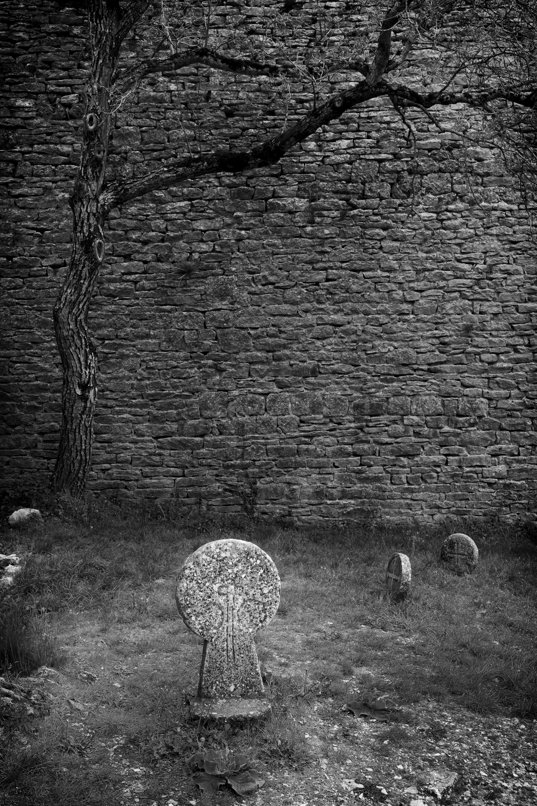

<!-- =========================
     COUVERTURE
========================= -->
<section class="cover page">

<h1>Odyssée ou Le monolithe</h1>
<h2>Notre histoire commune</h2>

<a class="enter" href="#" onclick="next(); return false;">
    Entrer →
</a>

</section>

<!-- =========================
     PAGE TEXTE INTRODUCTION
========================= -->
::: {.text-page .page}
::: {.text-content}

## Une histoire, une odyssée, le monolithe

C'est un récit photographique en 5 actes : le socle notre terre ; l’eau source de vie ;
l’arbre, symbole de vie ; pensées et croyances de l'homme conscient ; les monolithes.
Clin d'œil évident au film de Kubrick : ceux qui veulent poursuivre peuvent construire leur propre interprétation.
Oui, les monolithes, ces irréels d’aujourd’hui que j’ai voulus témoins de notre monde anthropique malmené et qui ouvrent des portes, je l’espère, sur vos propres possibles …

:::
:::

<!-- =========================
     PAGE TEXTE le socle
========================= -->
::: {.text-page .page}
::: {.text-content}
## Le socle ....

:::
:::

<!-- =========================
     PHOTOGRAPHIE S01
========================= -->
<section class="photo-page page">

Le socle, substrat de nos possibles

</section>

<!-- =========================
     PHOTOGRAPHIE S02
========================= -->
<section class="photo-page page">

Le socle, substrat de nos possibles

</section>

<!-- =========================
     PHOTOGRAPHIE S03
========================= -->
<section class="photo-page page">

Le socle, substrat de nos possibles

</section>

<!-- =========================
     PHOTOGRAPHIE S04
========================= -->
<section class="photo-page page">

Le socle, substrat de nos possibles

</section>

<!-- =========================
     PAGE TEXTE Eau
========================= -->

::: {.text-page .page}
::: {.text-content}

## ... Eau ...
D'abord, là où tout a commencé, l'océan.
 
Et puis, sources lacs et rivières.  

Avec la pluie.

:::
:::

<!-- =========================
     PHOTOGRAPHIE S05
========================= -->
<section class="photo-page page">

Eau

</section>

<!-- =========================
     PHOTOGRAPHIE S06
========================= -->
<section class="photo-page page">

Eau

</section>

<!-- =========================
     PHOTOGRAPHIE S07
========================= -->
<section class="photo-page page">

Eau

</section>

<!-- =========================
     PHOTOGRAPHIE S08
========================= -->
<section class="photo-page page">

Le rocher dans l'océan

</section>

<!-- =========================
     PAGE TEXTE Arbre
========================= -->

::: {.text-page .page}
::: {.text-content}

## ... Arbre de vie ...

 

:::
:::

<!-- =========================
     PHOTOGRAPHIE S09
========================= -->
<section class="photo-page page">

Germination dans la roche

</section>

<!-- =========================
     PHOTOGRAPHIE S10
========================= -->
<section class="photo-page page">

L'Herbe avant l'arbre

</section>

<!-- =========================
     PHOTOGRAPHIE S11
========================= -->
<section class="photo-page page">

L'arbre

</section>

<!-- =========================
     PHOTOGRAPHIE S12
========================= -->
<section class="photo-page page">

Arbres et Rocher

</section>

<!-- =========================
     PHOTOGRAPHIE S13
========================= -->
<section class="photo-page page">

La forêt comme apothéose

</section>

<!-- =========================
     PHOTOGRAPHIE S14
========================= -->
<section class="photo-page page">

Déclin

</section>

<!-- =========================
     PAGE TEXTE Croyances
========================= -->

::: {.text-page .page}
::: {.text-content}

## Croyances ...

 

:::
:::

<!-- =========================
     PHOTOGRAPHIE S15
========================= -->
<section class="photo-page page">

Magdalénien, la roche comme support

</section>

<!-- =========================
     PHOTOGRAPHIE S16
========================= -->
<section class="photo-page page">

Néolithique, le rocher devient mégalithe

</section>

<!-- =========================
     PHOTOGRAPHIE S17
========================= -->
<section class="photo-page page">

Moyen Age, stèle granitique

</section>

<!-- =========================
     PHOTOGRAPHIE S18
========================= -->
<section class="photo-page page">

Art roman, Christ et diable dans le grès

</section>

<!-- =========================
     FIN DU LIVRE
========================= -->

<!-- Compteur -->

<!-- Zones de navigation -->

