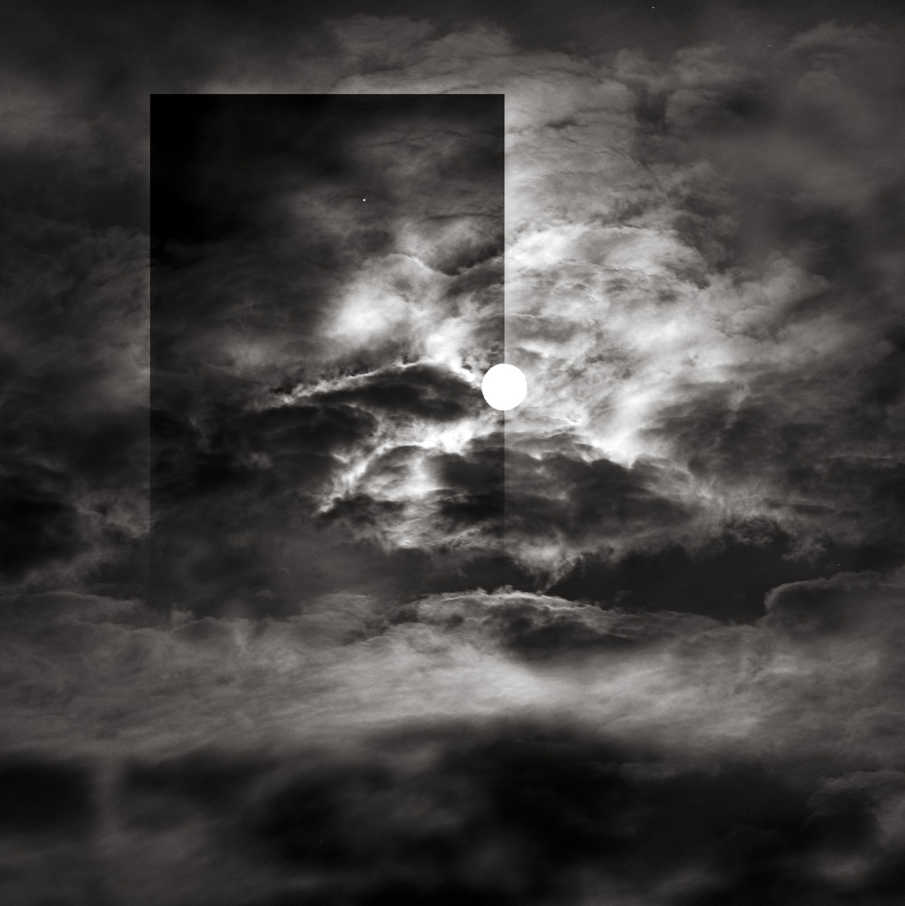
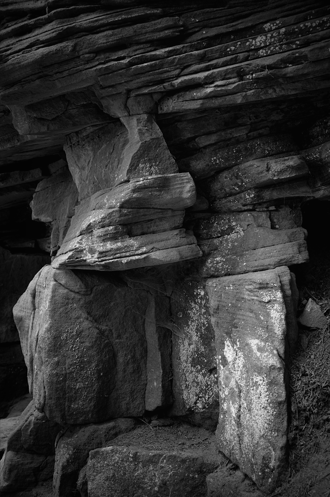
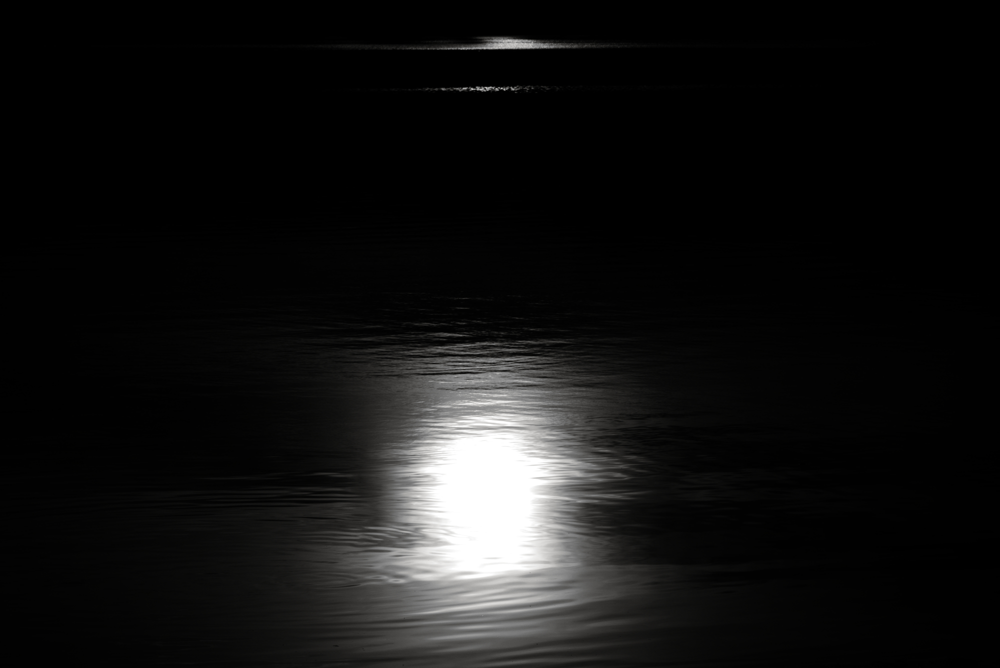
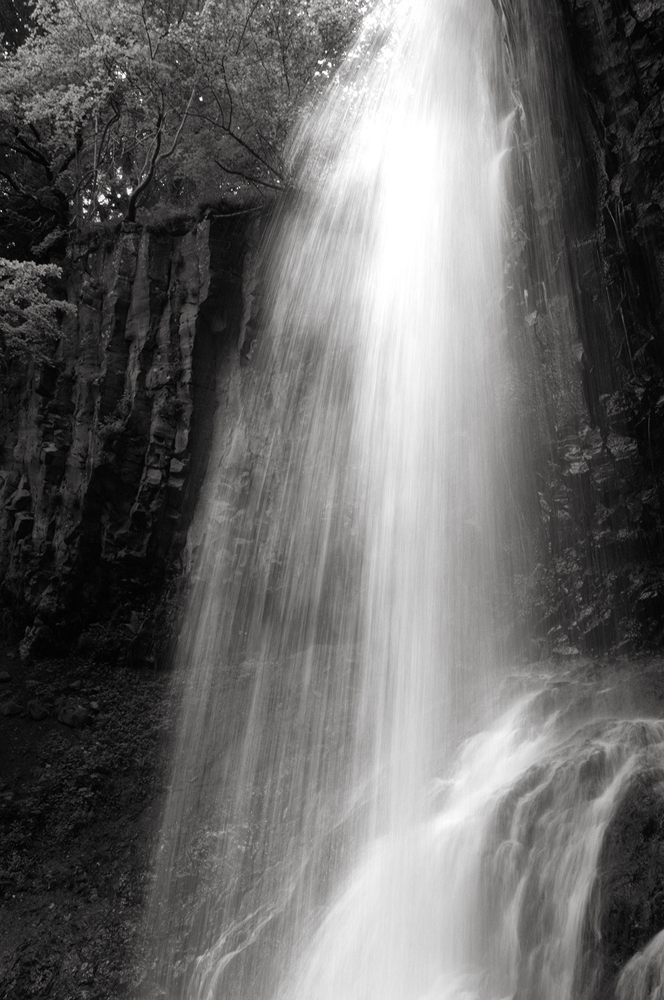

<!-- =========================
     COUVERTURE
========================= -->

<section class="cover page">

<h1>Odyssée  Le monolithe</h1>

<h2>Notre histoire commune</h2>

Une méditation sur l'évolution
de l'humanité

<a class="enter" href="#" onclick="next(); return false;">
    Entrer →
</a>

</section>

<!-- =========================
     PAGE TEXTE INTRODUCTION
========================= -->

::: {.text-page .page}

::: {.text-content}

## Une histoire, une odyssée, le monolithe

C'est un récit photographique en 5 actes : le socle notre terre,l’eau source de vie,
l’arbre, symbole de vie, pensées et croyances et les monolithes.
Clin d’œil évident au film de Kubrick où ceux qui veulent poursuivre peuvent construire leur propore interprétation.
Oui, les monolithes, ces irréels d’aujourd’hui que j’ai voulu témoins de notre monde malmené et qui ouvrent des portes je l’espère sur vos propres possibles …

:::

:::

<!-- =========================
     PAGE TEXTE le socle
========================= -->

::: {.text-page .page}

::: {.text-content}

## Le socle ....

:::

:::

<!-- =========================
     PHOTOGRAPHIE S01
========================= -->

<section class="photo-page page">

Le socle, substrat de nos possibles

</section>

<!-- =========================
     PHOTOGRAPHIE S02
========================= -->

<section class="photo-page page">

Le socle, substrat de nos possibles

</section>

<!-- =========================
     PHOTOGRAPHIE S03
========================= -->

<section class="photo-page page">

Le socle, substrat de nos possibles

</section>

<!-- =========================
     PHOTOGRAPHIE S04
========================= -->
<section class="photo-page page">

Le socle, substrat de nos possibles

</section>

<!-- =========================
     PAGE TEXTE Eau
========================= -->

::: {.text-page .page}
::: {.text-content}

## ... Eau ...
D'abord, là où tout a commencé, l'océan.
 
Et puis, sources lacs et rivières.  

Avec la pluie.

:::
:::

<!-- =========================
     PHOTOGRAPHIE S05
========================= -->
<section class="photo-page page">

Eau

</section>

<!-- =========================
     PHOTOGRAPHIE S06
========================= -->
<section class="photo-page page">

Eau

</section>

<!-- =========================
     PHOTOGRAPHIE S07
========================= -->
<section class="photo-page page">

Eau

</section>

<!-- =========================
     FIN DU LIVRE
========================= -->

<!-- Compteur -->

<!-- Zones de navigation -->

